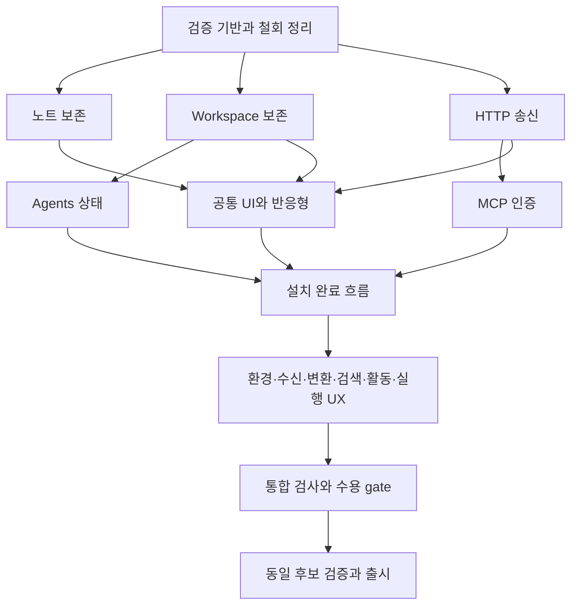

# Devbox 제품 완성도 재정비 실행 계획

> **For agentic workers:** 이 계획과 `AGENTS.md`·`CONVENTIONS.md`를 읽고 작업 묶음을 통합 개발 브랜치에 모아 최종 PR 1개로 실행한다. 별도 릴리스 스킬을 다시 만들지 않는다. 하위 에이전트는 필요할 때 주 에이전트 판단으로 GPT-6 Astra(`gpt-6-astra`) 또는 GPT-6.1 Sol(`gpt-6.1-sol`)만 사용한다. 다른 모델로 자동 대체하지 않는다. 구현과 검토를 분리하고 주 에이전트가 통합·검증 결과를 책임진다.

**Goal:** 감사 결함과 연결된 추가 개선을 해결하고, 설치부터 실제 작업·종료·복구까지 검증한 동일 후보만 다시 출시한다.

**Architecture:** 현 네 제품/Agent/native 소유권을 유지한다. 오류의 근원이 된 문서 수명·전송 모델·설치 상태·조회 갱신 경계를 정리하고 UI와 native 사이를 실행 가능한 수용 시나리오로 연결한다.

**Tech Stack:** Windows 11, Tauri v2, React 19, TypeScript, Rust, pnpm 9, 순수 CSS, 기존 tokens/typed IPC/CDP/UI Automation.

**Spec:** [제품 계약](01-product-contract.md). 원래 23건과 추가 검토 결과는 [추적표](08-traceability.md)에 연결한다.

**상태:** 통합 구현은 #616으로 머지했고, R16 후보 수용에서 확인한 출시 차단 결함을 보정 중이다. 배포 완료를 뜻하지 않는다. 실행 계획의 최종 범위는 모든 개선 구현, 문서 정합성 점검, 통합 PR 머지, v0.9.0 태그 재생성과 공개 릴리스까지다. 사용자 지시가 기존 작업별 PR·검증 규칙보다 우선하며 R00에서 저장소 운영 문서에도 반영했다.

**후속 실행 규칙:** 통합 구현은 [PR #616](https://github.com/jihoon22-lee/devbox/pull/616)으로 머지했다. 후보 검증에서 드러난 출시 차단 결함은 사용자 후속 지시에 따라 필요한 최소 보정 PR에 묶어 자율 처리한다. 추가 PR 승인을 매번 요청하지 않는다. 이는 초기 통합 PR 수 제한의 예외이며, source·필수 CI·설치/UI 수용·동일 후보 승격 조건은 유지한다. 실제 결과는 #616과 해당 보정 PR 본문·Actions artifact·Release notes에 기록한다.

## 1. 계획 수립 당시 기준과 이전 계획 처리

아래는 계획 수립 당시의 시작 상태다. 철회본 태그는 후보 준비 과정에서 기록된 object를 검증하고
명시적 lease로 제거했다. 현재 공개 여부와 최종 후보·태그 결과는 GitHub Release 및 PR 본문이 원장이다.

- 기준 HEAD는 `6450b6eb`(v0.9.0 공개 근거 기록)이며, 로컬 작업 브랜치는 `fix/suite/first-run-activation`이다.
- v0.9.0 Release와 7개 자산은 삭제, #580은 NOT_PLANNED로 닫힘. v0.9.0 Git 태그는 보존 중이다.
- 로컬에는 스킬/검사기 제거와 관련 문서 수정, Workspace setupOnly RED 테스트 2개가 있다. 이를 reset/stash 삭제하거나 새 계획 변경과 일괄 커밋하지 않는다.
- 구현 시작 시 R00은 스킬·원장·검증 기반 변경만 가져간다. 기존 RegistryGate RED 테스트 변경은 R07에서 가져가 수정과 함께 GREEN으로 만든다. 작업 트리가 clean이라는 가정으로 시작하지 않는다.
- 기존 2026-09-23 계획의 자원 제한·과제 TDD·squash·최종 CI·clean/merged worktree 정리 규칙은 유지한다. 과거 B1–B12 묶음·#580 원장·출시 후 기본 실기 확인 순서는 이번 재출시에 적용하지 않는다.
- **재출시 버전은 사용자 지정 v0.9.0이다.** v0.9.1 제안은 폐기한다. 현재 원격 annotated tag object는 `f31f111977956bd665cd432accdf54677444027f`, 대상 commit은 `e499ac7127269bf67863bf0fdc42eaf53236b9f3`이며 공개 Release는 없다(이번 개정에서 조회). 최종 준비 후 R16에서 철회 이력을 보존하고 기존 태그를 제거한 뒤, 후보 검증에 성공한 최종 main에 같은 이름의 새 annotated tag를 만든다. 계획 편집 중에는 태그를 변경하지 않는다.
- #580 재오픈, 새 실기 요청 이슈/댓글, 새 release dispatch는 계획 수립의 일부가 아니다.

## 2. 문서 구성

| 문서 | 내용 |
|---|---|
| [01-product-contract](01-product-contract.md) | 유지할 구조, 제품별 기대 동작, UI/데이터/실행 계약, 제외 범위 |
| [02-foundation-shell-install](02-foundation-shell-install.md) | R00 검증 기반·철회 정리, R06 공통/앱 UI, R07 설치 완료 흐름 |
| [03-workspace](03-workspace.md) | R02 초안·종료·전환 보호, R03 agent registry, R14 실행 상태/재시도 UX |
| [04-api-studio](04-api-studio.md) | R04/R05/R08–R11 요청·환경·인증·수신·변환 |
| [05-knowledge](05-knowledge.md) | R01 문서/복구, R12 검색, R13 활동·수집 안내 |
| [06-acceptance-release](06-acceptance-release.md) | 검증 계층, Windows UI·실기 매트릭스, R15 통합/R16 후보·출시 |
| [08-traceability](08-traceability.md) | 감사23건·추가 결함·추가 개선의 소유 작업/시험/종료 조건 |

## 3. 단일 PR 안의 작업 순서·의존성·산출물

**R00–R16은 PR 17개가 아니라 작업 묶음 17개다.** 통합 개발 브랜치는 `fix/suite/v0.9.0-readiness`로 계획한다(저장소 §8 명명 규칙). 작업별 브랜치·worktree·커밋은 필요에 따라 나누고 선행 작업의 검토·좁은 검사를 마친 변경을 통합 브랜치에 merge/cherry-pick한 뒤 후속 작업을 시작한다. main 머지나 원격 CI를 작업 간 선행 조건으로 두지 않는다. 최종적으로 통합 브랜치→main PR **1개만** 생성한다.

| 작업 | 목적·확정 결함 | 선행 | 완료 산출물 | 상세 |
|---|---|---|---|---|
| R00 | 철회 원장·스킬 제거·실제 UI 검증 기반 | — | 과거 면제 정리, native 경계를 반영한 fixture 규칙, UI driver와 evidence schema | 02 |
| R01 | Knowledge 문서 identity/Undo·저널 복구 K1/K5 | R00 | cross-note 무오염, 삭제 원본 복구, 종료/폐기 계약 | 05 |
| R02 | Workspace dirty 복구·종료·공통 전환 guard W1/W2 | R00 | 실제 recovery writer, save/discard/cancel, Source 초안 보호 | 03 |
| R03 | Agents 등록/삭제 뒤 registry/context 일치 W3 | R02 | mutation 후 canonical snapshot과 context의 일관된 게시 | 03 |
| R04 | HTTP/SSE 송신 의미 AS-01/02/07 | R00 | 활성 필드만 송신/변수 검사, URL/form serialization, wire parity | 04 |
| R05 | MCP 실제 인증과 화면 일치 AX-01 | R04 | 적용된 grant 표시·변경 시 재연결, mutation 중복 방지 | 04 |
| R06 | 공통 shell·전 제품 반응형/키보드 UX S1/K7 | R01/R02/R04 | delivery 상태별 정상 배치, 최소 창 사용 가능, 오류 복구 표시 | 02 |
| R07 | 설치·준비·활성화·재개 W0/C1 | R03/R05/R06 | Control Center의 연속 설치 안내, 권한 일치, helper 재실행까지 UI 완료 | 02 |
| R08 | 환경 편집·저장/오류 AS-04/05/06 및 N02 | R05/R06 | 안전한 key CRUD·새 환경 선택·모든 route의 저장 실패 안내 | 04 |
| R09 | Webhook 실시간 수신·복구 AS-03 | R07 | 가시성 기반 갱신·새 수신/재연결·보존/중단 표시 | 04 |
| R10 | gRPC 부분 결과 AX-03 | R08 | 누적 응답·terminal status·history 일치 | 04 |
| R11 | Transform 저장/수정/삭제 AX-02 | R06 | 편집 identity 보존, 저장 한도에서 회복 가능 | 04 |
| R12 | 검색 후보 정확성·색인/결과 UX K3 | R01/R06 | regex 누락 방지, bounded 결과 표시, source/mode 복원 | 05 |
| R13 | Activity 집계·재생성·설정·수집 안내 K2/K4/K6 및 N03/N04 | R01/R06 | idle 제외 일치, history 기간별 재생성, 설정 실패 전달, owner 설명 일치 | 05 |
| R14 | Workspace 실행 결과·재시도·진단 UX | R03/R06 | 결과 불확실 상태의 receipt 조회, 안전한 retry, terminal/provider 복구 | 03 |
| R15 | 네 제품 여정 통합·필수 수용 gate 확정 | R01–R14 + R16 문서/입력 준비 | 로컬 영향 검사와 중복 없는 runner·gate, 후보 전 미실행은 명시 | 06 |
| R16 | v0.9.0 문서·배포 입력 확정 및 재출시 | 준비는 R00부터, 최종 수용은 R15 | 단일 PR 머지·exact-main 후보·새 v0.9.0 태그·동일 7개 파일 공개 | 06 |

R09와 R10은 같은 앱이어도 live owner 갱신과 gRPC 결과 보존의 위험/되돌리기 경계가 달라 분리한다. R04와 R08도 wire semantics와 환경 편집/비밀 보존을 분리한다. 계획의 인터페이스가 필요한 작업을 선행 변경의 통합 전에 임의로 시작하지 않는다.

### 실행 묶음

1. **기반:** R00. Windows UI driver의 입력·화면 관찰·정리 능력을 먼저 확인한다.
2. **손실/오전송 차단:** R01/R02/R04 병행 가능. 각 후속 R03/R05를 순서대로 연결한다.
3. **실사용 진입:** R06 → R07. 기능 보호가 없는 상태에서 자동 창 닫기/설치 orchestration을 구현하지 않는다.
4. **앱별 완결:** R08–R14. 파일이 겹치지 않는 R11/R12/R13은 병행 가능. `requests/App.tsx`·shared CSS·native request 모듈은 한 시점 한 담당자만 수정한다.
5. **통합 검사와 수용 준비:** R15. 앞 작업의 UI/native 시나리오를 연결하고 로컬에서 필요한 영향 검사를 수행한다. 후보 bytes가 필요한 전체 수용은 R16에서 한 번 완료한다.
6. **출시:** R16. 문서/패키지 입력은 최종 PR 전에 확정하고, 단일 PR 머지 후 exact-main 후보를 만든다. 예전 v0.9.0 증거나 코드가 다른 fixture의 PASS를 승계하지 않는다.

도식의 APP은 위 표 R08–R14를 묶어 표시한 것이며 세부 선행은 표가 우선한다.

## 4. 필요한 검증만 수행하는 통합 절차

검증 신뢰도는 횟수가 아니라 **실제 실패 원인·변경 영향·관찰 결과**로 판단한다. 상세 문서의 시험 목록은 선택할 수 있는 검증 계약이며 매 작업에서 모든 명령과 계층을 실행하라는 체크리스트가 아니다.

| 시점 | 필수 실행 | 반복하지 않는 것 |
|---|---|---|
| 결함 수정 | 기존 재현을 재사용하거나 원인에 직접 닿는 최소 회귀를 RED→GREEN으로 확인; 관련 회귀만 실행 | 같은 실패를 unit·mock·browser·Windows에서 매번 중복 재현, 단순 문서/배치 수정용 형식적 테스트 |
| 작업 통합 | diff·충돌 해결 검토와 실제 영향받은 계약/교차 앱 회귀 | 작업별 전체 build·clippy·verify:affected/all·CI |
| 모든 구현·문서 통합 완료 | 최종 영향 범위 검증 1회; 이번 전체 재정비에서 all이면 그 1회가 affected도 충족. Biome·bindings·문서 검사도 포함 여부 확인 | all 직후 affected 또는 반대 순서, 이미 포함된 검사 재실행 |
| 최종 PR 1개 | 로컬 확인 뒤 한 번 push·PR 생성, required CI 실행 | 작업 브랜치별 PR·초안 PR·습관적 CI dispatch |
| 최종 main과 릴리스 | exact-main CI 1회, 후보 빌드/필수 패키지 수용, 동일 bytes 승격과 공개 다운로드 확인 | candidate와 같은 전체 수용을 별도 product-foundation dispatch로 재실행 |
| 실패·추가 변경 | 원인 수정들을 모은 뒤 실패 항목과 영향 범위만 보충 | 무관한 통과 검사 또는 전체 CI 무조건 재실행 |

- **CI를 총 1회라고 약속하지 않는다.** 현재 main push에는 CI가 없고 squash 뒤 SHA가 달라지므로 PR 필수 CI 1회와 최종 main CI 1회는 서로 다른 필수 목적이다. 후보·공개 workflow는 배포에 필요한 별도 실행이다. 이 최소 경로 외 작업별 CI는 없애며 원인 없는 재실행은 하지 않는다. workflow/required-check 의미를 바꾸어 검사를 우회하지 않는다.
- 개발 중 검사는 로컬 WSL/Windows가 기본이다. Windows 설치·OS 변경/WSL/Docker 등 기존 서비스에 영향을 주는 시험은 준비된 독립 VM을 우선하고, 불가능하면 최종 후보의 격리 hosted 환경에 합친다. 해당 실행 전에는 NOT_RUN으로 표시하되 무관한 구현을 막지 않는다. 사용자 호스트 서비스/방화벽을 변경하지 않는다.
- 06의 40개 ID는 **수용 결과 추적 단위**다. 별도 프로세스·빌드·workflow 40개가 아니다. 하나의 UI 여정에서 여러 ID를 판정하고 fixture·앱 시작·빌드를 재사용한다. L1–L5 전 계층을 매 항목에 강제하지 않으며 선택 이유와 남은 경계만 기록한다.
- 설치/복구/핵심 UI·실제 전송·저장 결과는 출시 전 필수다. 로컬 개발 UI 결과는 패키지 수용을 대신하지 않지만, 같은 package/source/fixture의 통과 결과는 관련 입력이 바뀌지 않는 한 재실행하지 않는다. 다른 SHA·digest를 새 성공으로 둔갑시키지 않는다.
- 좁은 cargo/pnpm 검사도 `python3 .github/scripts/verify-resources.py -- <명령>`으로 실행한다. Rust 전에는 `source ~/.cargo/env`. 최종 통합 검사에 포함된 `pnpm exec biome ci .`를 별도 반복하지 않는다.
- R01–R06의 개발용 L4는 준비한 소유 namespace를 사용할 수 있고 최초 설치 PASS와 구분한다. 작업별 L4 완료를 통합 선행 조건으로 강제하지 않는다. 최종 후보의 필수 L4/L5 미실행·실패는 출시 차단이다.
- 커밋은 영어 Conventional Commits로 자유롭게 나누고 각 작업의 변경·근거를 추적한다. 로컬 상세 검증 후 단일 PR에 모든 R ID와 문서 변경을 포함한다. CI 실패 수정도 같은 PR에서 처리하며 쪼개진 보정 PR을 계획하지 않는다.
- R16 준비 문서는 R15 최종 검사 **전에** 합친다. 검증 결과를 기록하려고 main을 다시 바꾸는 별도 문서 PR은 만들지 않는다. 런타임 결과는 같은 PR 본문·Actions artifact·Release notes에 기록한다.

## 5. 메모리·디스크·에이전트 운영

- 시작과 무거운 검사 전후에 WSL `free -h`, `vmstat`, 필요한 파일시스템 `df -h`와 소유 build/fixture 디렉터리 크기를 확인한다. Windows 빌드/실기 전에는 Windows 가용 메모리·commit 사용량과 해당 프로세스 사용량도 확인한다. WSL 제한이 Windows·에디터·하위 에이전트까지 적용된다고 가정하지 않는다.
- 기존 supervisor의 package 1개, Vitest worker 2개, Cargo job 2개, Rust thread 2개, CPU 4개, memory high 6GiB/max 8GiB, swap max 1GiB를 상한 출발점으로 쓴다. worktree가 여러 개여도 무거운 검증은 한 번에 하나다. Windows와 WSL의 대형 빌드도 겹치지 않는다.
- 가용 메모리가 host 전체의 20% 아래로 내려가거나 swap/pagefile 활동과 지연이 함께 증가하면 새 무거운 작업을 보류하고 worker/job을 1로 낮춘다. 메모리 한도를 키워 밀어붙이거나 OOM을 무제한 재실행하지 않는다. 기존 측정 로그로 peak·소요 시간·조정을 남기고 별도 상시 모니터링 시스템은 만들지 않는다.
- 하위 에이전트는 **GPT-6 Astra 또는 GPT-6.1 Sol만** 사용한다. 주 에이전트가 독립성·메모리 여유·공유 파일 충돌을 보고 필요할 때만 배정한다. 분석/검토는 병행할 수 있지만 각 에이전트가 별도 전체 빌드/검증을 시작하지 않게 한다.
- 각 작업 종료 시 소유한 임시 설치본·fixture·중복 ZIP·중간 screenshot·실패 덤프를 점검한다. 재현에 필요한 첫 실패 증거와 최신 유효 증거, 활성 후보/미통합 변경은 보존하고 이미 참조가 끝난 중복 산출물만 정리한다. 증거에는 정리 전후 크기와 보존 위치를 기록한다.
- 공용 dependency/Cargo cache를 매번 지워 다음 빌드를 느리게 하지 않는다. 정리는 공통 실행 잠금 아래에서 관련 프로세스가 없는 것을 확인한 뒤 한다. 사용자 데이터·다른 작업 산출물·활성/잠긴/dirty/미통합 worktree는 삭제하지 않는다.
- 전용 작업 브랜치가 통합 브랜치에 포함되고 clean이면 전용 worktree 제거→prune→로컬/원격 작업 브랜치 정리 순서로 누적을 막는다. cherry-pick이면 patch 동등성과 통합 commit을 확인한다. 최종 통합 브랜치는 main 머지 후 정리하며 호스트 소유 root checkout은 제거하지 않는다.

## 6. 완료 범위와 계획 변경 기준

완료는 모든 개선 구현, 앱별 필수 수용, **전체 현재 문서 정합성 확인**, 단일 PR 머지, 최종 main 검증, **v0.9.0 태그와 공개 릴리스**, 다운로드한 배포본 확인 및 임시 자원 정리까지다. 구현 완료·PR 수용·출시 완료를 구분한다. #580 재오픈이나 사용자에게 기본 설치/UI 검사를 넘기는 이슈는 만들지 않는다.

새 데이터 손실·잘못된 외부 mutation·설치 불능이 발견되면 같은 통합 범위에 소유 작업과 최소 재현을 추가한다. 사소한 수정마다 새 PR·새 전체 검증을 추가하지 않는다. 새 제품/저장소 포맷/권한 확대 같은 범위 변화는 구체 설계로 보고한다.

달력 완료일이나 검증 횟수를 진행률로 사용하지 않는다. 작업별 해결 여부·남은 실제 위험·필수 환경 준비 상태를 보고한다. 설치/Windows 입력 환경과 큰 자원 병목은 R00에서 먼저 확인하되 거대한 검증 프레임워크 개발을 제품 수정의 선행 과제로 키우지 않는다.
