# B08 — Control Center and recoverable suite delivery

Refs #550, #541, #542. B08 is one implementation/importer/installer/fixture PR.
Accepted base is main `138c49fe` (B01–B07 merged). B08's implementation, importer
bindings, delivery fixtures and documentation are now assembled for final PR
validation in PR #561. Final checks are underway; #550 remains open until native
delivery acceptance and required CI finish.
B09 has not started. No production installation or migration is authorized by a test.

## Implementation boundary

Reuse Manager's existing doctor, Data Inspector, redacted support bundle, Related
Tools and package-only Dev Setup. Keep its legacy batch installer separate from
new generation activation. Expose only four user products. Inventory must distinguish
unknown installer evidence from absence and identify exact Manager-owned portable
registrations; arbitrary uninstall strings and guessed executable paths are denied.

Compose the existing owner importers with consistent WAL-aware source acquisition,
explicit source/destination reviews and resumable receipts. Package stages preserve
the previous generation; quiesce, activation, health and commit are explicit phases.
A verified bootstrap helper owns Control Center replacement. Post-commit downgrade
and uninstall preserve new user data and external vault/repository edits.

The v0.8 asset goal is one suite setup, four product ZIPs, manifest and notices;
its actual manifest/assembly/installer contract must be implemented and verified
before B09 uses it. No public RC or unverified stable promotion.

## Verification policy

Commit checks are minimum syntax/types and diff/plan review. Detailed verification
runs once after all B08 implementation/importers/fixtures are assembled. Add only
missing native installer and fault-injection acceptance, retain unrelated passes.
All network/service-changing fixtures run on disposable hosted Windows VMs. Never
provision local Docker/WSL or mutate existing services, firewall rules or routes.

## Final B08 review packet and acceptance map

Semantic changes: installed physical identity/write admission, owner source/backup
bindings, generation/data recovery, update download authority and reviewed package
removal. Mechanical moves: Manager frontend consumers moved into
`packages/control-center-features` with existing legacy wrappers retained until B09.
No public topology or stable release is changed by this PR.

| Requirement / scenario | Implementation and acceptance source | Final result |
|---|---|---|
| R01/R02/R23, S05 | Products/Components inventory, deterministic four ZIPs + one Suite NSIS + manifest/notices; package/installer Python fixtures and Windows four-link/one-ARP fixture | Pending |
| R14–R19 | Native route allowlists/provenance; verified component capture; product/worker writer leases; original helper dispatch and explicit download/install/cleanup reviews | Pending CI + native |
| R20/R21, S06 | Existing owner importer fixtures; fresh source observation/accepted backup binding; WAL-aware Knowledge/Runtime checks; closed API/Terminal browser checks; explicit skipped source review | Pending CI + native |
| R22, S07 | Durable journal reopen at every phase; directory-identity rename boundaries; two-generation metadata crash/replay fixtures; native stale-source, missing health, restore/update undo and cleanup-lock failures | Pending |
| R22/R23, S07 | Closed product checkpoints, original directory preservation, exact-package reinstall, downgrade block, data-preserving uninstall and unknown-file retention | Pending native |
| R15/R23, S07 | Pinned legacy installed files + exact registry/shortcut review, Manager manifest CAS/file identities, visible partial cleanup and resume | Pending native |
| R24/R25 | Existing resource budgets, lazy route surfaces, bounded caches/retention, one affected run and authoritative CI; unchanged accepted domain evidence retained | Pending |
| S08 | Recovery/diagnostic messages and unchanged accepted degraded-owner behavior; final OS IME/monitor qualification remains explicitly B09 | B08 portion pending |

The durable-record and rename crash cases are fixture/model tests, not claims of
physical machine power-loss testing. Native acceptance launches the actual installed
products, records authenticated four-owner health, and runs the real NSIS install,
uninstall and original-helper update delegation. The update fixture uses a distinct
same-version payload with the same binaries and records that scope explicitly.
Source/fixture SHA and original artifact run are kept separate when reusing binaries.

```mermaid
stateDiagram-v2
    [*] --> Import: verified packages and private namespaces
    Import --> Health: explicit source review and closed source/data checks
    Health --> Committed: four fresh native owner reports
    Health --> Import: preserve data and review again
    Committed --> UpdateHealth: preserve original data; run candidate copies
    UpdateHealth --> Committed: fresh health and explicit commit
    UpdateHealth --> Committed: restore original directories and packages
    Committed --> CleanupPending: explicitly reviewed legacy cleanup fails
    CleanupPending --> Committed: resume exact remaining identities
```

Partial package extraction is retained before retry; completed changed packages are
never silently repaired. Space preflight reads actual Windows free space and counts
package/copy requirements, while actual I/O failures remain recoverable. Uninstall
preserves unknown content and never-activated incomplete candidates. Reinstall keeps
the data identity and requires the exact last package before a later normal update.
Backup/partial retention caps require review instead of silent deletion. There is no
transaction spanning filesystem, registry, four databases and external vaults.

Validation sequence: `pnpm verify:affected` once after this completed bundle; required
CI (including Python asset fixtures and Windows unit tests); one hosted native
foundation/delivery run. Failed scopes are fixed together and retried only where
needed, using retained original artifacts for fixture-only corrections. No local
Docker, WSL provisioning, networking or service mutation is part of these checks.

## Implementation history

Earlier “pending implementation” notes below describe their commit-time state;
the current boundary and acceptance map above take precedence.

## Existing Manager tools as an actual second consumer

Manager UI/tests moved to control-center-features with legacy wrappers. Control
Center consumes its controlled tools modes without legacy catalog/install refresh
or install AppLink handling. Styles are scoped to the shared tools root; standalone
Manager retains its document reset. Existing native doctor/diagnostics/support,
Related Tools and reviewed package-only Dev Setup commands are embedded through a
local Control Center route allowlist. No legacy batch install or bootstrap runs.
Official URLs resolve against the native curated list without installation probes.
The new tool component/capability and catalog dependency edges are registered.
Dependency locks add only the internal consumers; unrelated transitive pnpm changes
from lockfile resolution were removed. No B08 detailed test/build/audit has run.

## Inventory and recovery implementation

Native package capture supplies a four-product/component inventory without starting
peers. Unknown binary/ARP/runtime observations stay unknown; a verified portable
manifest can separately report an omitted product. Products/Components consume the
local delivery authority. Recovery displays durable journal metadata only; it does
not repair/delete user stores. Manager diagnostics remains a separate existing tool.

The generation journal records stage/verify/backup/import/validate/quiesce/activate/
health/commit/cleanup phases, owner/source/destination mappings and retained backup
metadata. Conflicting replay, stale revisions and incomplete cleanup are explicit.
Precommit recovery blocks writers before restoring prior packages; postcommit cleanup
failure keeps the new suite active. Native durable storage uses a retained lock,
filesystem identities, bounded JSON and compare/write revisions. The actual package
stager/bootstrapper/owner importer orchestration is not connected yet.

Product namespace selection now recognizes only verified closed generation layouts.
The physical root identity plus manifest installation ID keeps data identity across
package generations; a copied manifest ID in another root does not alias that data.
Direct portable/development location identity remains compatible. The executable
hash/version and active generation must match before selecting a generation's data
namespace. Synthetic regression cases are prepared, not executed ahead of B08's
complete PR audit. Installer startup/write barriers and health/commit integration
still need implementation before this is an accepted activation path.

The package contract now requires one setup, four product ZIPs, notices and a
schema-2 release manifest. A deterministic assembly script binds the source SHA,
exact file closures and standalone portable declarations; it does not build or
publish anything. The stager validates archive and member hashes/limits, rejects
unlisted paths, links, encrypted/directory entries and existing destinations, pins
Windows stage directories, and suppresses the portable manifest that would shadow
a suite root declaration. Synthetic escape/cancellation/preservation fixtures are
prepared for the final B08 audit. No package staging has run on a user installation.

A shared product/worker lifetime lock now excludes late v0.8 writers while the
updater holds the exclusive gate. The API service and browser preservation workers
retain the same lease. Generation installations fail closed if their gate is
missing or an update owns it. Detailed bootstrap/legacy writer quiesce and controlled
health/import worker admission remain to connect; this is not completed recovery
acceptance. Minimal library type checks passed (34.755 seconds), with unused legacy
Manager entrypoint warnings in embedded mode to resolve before final Clippy.

Legacy inventory now reads Manager's original identifier namespace and pinned
v0.7 catalog revision instead of treating the Control Center data directory as a
legacy root. ARP discovery reads bounded current-user/machine x64/x86 registry
views and reports partial access and uninspected other users explicitly. ARP strings
are retained only as hashed observation identities; no uninstall command is run.
Manager-owned records and Windows installer declarations are separate in Migration.
Actual executable/uninstaller proofs and reviewed cleanup are still to implement.
The embedded library excludes the unused standalone AppLink module; legacy Manager
install entrypoints remain unregistered, with their intentional dead code annotation
limited to that module when standalone is disabled. ZIP's full existing deflate
feature now selects a backend even when Control Center is compiled alone. Minimum
native/frontend type checks passed after that feature correction (9.620 seconds).

## Bootstrap and activation barrier

Control Center now has a separate devbox-suite-bootstrap binary target. Its stage
entrypoint validates its own image against the private payload, reuses Manager's
local-root protections, admits a new empty generation directory, and records a
root-identity/payload-bound owner and receipt. A fully written interrupted stage can
be re-observed without overwriting files; partial or unrecognized content requires
recovery and remains preserved. No registry edit, active-generation replacement or
user-data migration is implemented by this stage-only command.

The shared native activation marker distinguishes Import/Health/Committed/Recover.
Generation product requests cannot start business writers before commit; native
Runtime initialization, Knowledge background activation and standalone API service
workers check the same barrier. Peer command execution also checks it. Products
show the pending phase in their shared shell. Direct development/portable behavior
is preserved. The bootstrap install/finalize/rollback orchestration, owned-worker
admission, owner importer reports and installer UI remain unfinished.

Minimum library/bin type checking passed after using the existing opaque operation
ID contract (37.819 seconds). The completed bootstrap/native description and shared
shell types passed (7.497 seconds). No B08 detailed tests, builds, actual staging or
installer execution have run. The ARP module now belongs only to Control Center,
not the shared suite platform source included by all four product crates.

Legacy binary observation now verifies declared installer executables against the
actual public v0.7 release manifest, pinned to the existing baseline SHA-256. The
manifest was downloaded read-only and matched the 15-app baseline before inclusion.
Native ARP inspection validates the declared local root, exact display-icon target,
version, executable size/hash and file identity. This confirms only the executable;
uninstaller verification/cleanup remains separate. Minimum CC library/bin and UI
types passed (8.071 seconds); no installed legacy app or uninstaller was run.

The pinned v0.7 lock uses Tauri CLI 2.11.4. Its upstream NSIS template calls a
basename-based process-kill helper during uninstall and removes a shared autostart
value. Therefore B08 must not execute that uninstaller against live user installs;
cleanup will instead delete only verified files/registrations/shortcut targets.
Source: https://raw.githubusercontent.com/tauri-apps/tauri/tauri-cli-v2.11.4/crates/tauri-bundler/src/bundle/windows/nsis/utils.nsh
and the adjacent installer.nsi uninstall section.

A manual-only hosted reference acquisition is prepared to derive the immutable file
closure (including uninstall.exe) from each pinned public installer at two owned
roots. This resolves the concrete missing ownership reference for safe cleanup;
it builds no product and starts no legacy app. No local execution is permitted.
Detailed B08 fault/installer acceptance remains at PR completion.

### 2026-09-19 재개: 첫 설치 준비와 owner 관측 계약

- bootstrap `--prepare-install`은 root/실행 파일/payload identity를 확인하고 generation,
  namespace, writer lock, journal과 Import marker를 준비한다. 일반 실행의 쓰기 권한은
  여전히 닫혀 있으며 이전 완료나 활성화 성공으로 보고하지 않는다.
- owner의 제한된 importer와 제품 연결 검토만 Import 단계에서 허용한다. Workspace는
  importer 저장소만 열고 scheduler/maintenance를 시작하지 않는다. 세 owner의 native
  migration summary를 Control Center에서 명시적으로 조회한다. 이는 commit proof가 아니다.
- 이전 최소 확인 결과 보존: install preparation Rust check 2.831s, owner coordination
  Rust/TypeScript check 25.806s PASS. full PR 검증은 아직 실행하지 않았다.
- pinned legacy installer의 installed-file closure 수집은 기존 foundation workflow의
  수동 `legacy_reference_only` 모드로 분리했다. 일회성 hosted Windows VM에서만 실행하고
  제품 재빌드·Docker·로컬 설치는 하지 않는다. 실제 사용자 설치에는 legacy uninstaller를
  실행하지 않는다. 수집 결과가 확보된 뒤 exact-file cleanup을 구현한다.

### 실제 legacy 설치 identity 및 첫 설치 취소

- [hosted reference acquisition 35431855772](https://github.com/jihoon22-lee/devbox/actions/runs/35431855772)
  PASS: pinned v0.7 installer 15개를 두 owned root에 각각 설치하고 완전한 파일 목록을 비교했다.
  실행 파일·uninstaller·notices 및 Code Pad companion의 SHA/size가 두 경로에서 동일했다.
  앱은 실행하지 않았고 fixture 소유 설치를 제거했다. 수집에 제품 build는 없었다.
- 모든 앱의 installed executable은 public portable executable과 hash가 달랐다.
  ARP inventory는 portable SHA 대신 검증된 installed reference를 사용하도록 수정했다.
  reference 원본 provenance는 `resources/legacy-v0.7-installed-files.json`에 보존한다.
  현재 검증은 소유 파일 확인이며 사용자 설치 제거/정리 실행은 아직 연결하지 않았다.
- `--recover-install`은 미확정 첫 설치만 처리한다. native root/payload/journal identity를
  대조하고 exclusive writer gate를 잡아 모든 제품이 종료됐음을 요구한다. Recover marker를
  먼저 기록한 다음 journal을 종료하며 파일/legacy 원본/이전한 v0.8 데이터는 삭제하지 않는다.
  committed 설치나 previous generation이 있으면 별도 데이터 복구 계획을 요구한다.
- journal은 다음 작업을 시작할 때 완료된 기록을 보존한다. 미완료 작업 교체, 설치 identity
  변경, 실제 이전 generation과 다른 연결을 거부하며 archive 이후 crash 재개 fixture를 준비했다.
- 최소 Rust check: 설치 reference 4.998s, bootstrap recovery 2.131s PASS.
  앞선 non-Windows branch의 unit/Result 혼합 타입 오류를 수정했다. 새 regression fixture는
  PR 구현 완료 시 실행한다. B08 전체 검증/실제 Suite installer acceptance는 아직 미실행이다.

### 중단한 첫 설치 재시작

- `--restart-install`은 이전 작업이 Recovered이고 활성화된 이전 세대가 없는 경우에만
  새 operation/generation을 할당한다. 기존 부분 파일과 가져온 데이터는 보존하며 새 package
  slot을 준비한다. 다른 payload나 이미 committed인 설치에는 이 경로를 쓰지 않는다.
- restart intent를 먼저 보존하고 completed journal을 archive한 뒤 새 journal을 시작한다.
  intent 기록 직후 crash는 `--prepare-install`로 이어갈 수 있다. 이전 manifest 교체는
  archived Recovered journal과 Recover marker가 모두 일치할 때만 허용한다.
- 최소 Rust check 1.829s PASS. archive read-back/동일 slot 거부/사용자 데이터 보존 회귀
  fixture를 준비했으며 PR 완료 시 실행한다. 실제 setup/업데이트/활성화 수용은 아직 남아 있다.

### Suite setup 준비 진입점

- `build-suite-installer.py`는 기존 네 ZIP/private payload와 일치하는 bootstrap을 확인하고
  Windows NSIS 준비 진입점을 생성한다. `--emit-only`로 source를 검토할 수 있으며 실제
  compile은 Windows의 명시적 NSIS 경로를 요구한다. 현재 public release에는 연결하지 않는다.
  [NSIS Modern UI](https://nsis.sourceforge.io/Docs/Modern%20UI%202/Readme.html)의 finish-run
  function으로 Control Center 열기를 선택한다. 화면은 활성화 완료가 아니라 준비 완료라고 표시한다.
- 설치 폴더의 첫 생성도 helper가 수행한다. 기존 plain ancestor와 prospective root를 먼저
  확인하고 native directory identity를 유지한다. NSIS가 검증 전 UNC/junction 폴더를 만들지 않는다.
- `--open-install`은 root/payload/manifest/marker를 대조하고 pinned member만 실행한다.
  WebView override와 stdio를 전달하지 않아 다른 제품의 프로필이나 NSIS pipe를 물려주지 않는다.
  제품의 `--suite-setup`은 release에서도 native marker로 migration/recovery/products 화면을
  선택한다. 일반 `--route` 개발 경계나 command 권한은 확대하지 않는다.
- Python AST/diff 및 최소 Rust check PASS (`b08-setup-final-types.log`). 실제 NSIS compile,
  helper launch, ARP/shortcuts/uninstall/update와 health/commit은 B08 전체 수용에 남아 있다.

- Setup assembler의 tampered helper/ZIP, manifest 경로 이탈, mixed version,
  기존 candidate 보존 fixture를 준비하고 dependency policy CI에 등록했다.
  Python AST/diff만 확인했으며 전체 구현 완료 전 반복 실행하지 않았다.

### Owner 이전 매핑 관측 연결

- API Studio는 browser/native 적용을 모두 승인한 complete import의 retained mapping만
  집계한다. Knowledge는 선택된 세 store의 실제 ID receipt를 읽는다. record ID·경로·본문은
  공유하지 않고 bounded count와 deterministic revision만 Control Center에 반환한다.
- Knowledge 각 DB는 독립 read transaction이며 global transaction으로 주장하지 않는다.
  신규 source backup이나 활성화 완료 proof로도 취급하지 않는다. Workspace의 미연결 매핑
  관측은 0으로 표시하지 않고 확인 필요로 남긴다.
- blocking owner reader는 제품당 한 슬롯으로 제한하고 async pipe/event loop에서 분리했다.
  UI의 명시적 상태 읽기에만 실행하며 background polling을 추가하지 않았다.
- 최소 Rust/Control Center TypeScript check PASS 46.395s. 브라우저 미승인 행 제외,
  opaque ID·destination 변경·잘못된 receipt 타입 회귀를 준비했으며 PR 완료 때 실행한다.

### Native product health observation (2026-09-19)

- Added a Control Center-only health call over the already approved physical
  installation bus. Native challenges, generation, installation key, live main
  shell session, catalog revision and exact routes are checked at the receiver
  and host. No cold launch, business operation, service or scheduler is invoked.
- Owners read their existing migration/store state on bounded blocking workers.
  Workspace additionally revalidates selected component directories and Registry;
  Control Center reads Launcher preferences, shortcut config and import journal
  without applying settings or registering shortcuts. Incomplete imports remain
  unready. Responses contain digests/state, not raw preferences or user records.
- Updates and Recovery show the four independent observations. These are native
  package/shell/store observations, not renderer parity, a global data transaction,
  source backup evidence or an activation commit permission.
- Prepared contract regressions for stale challenge/generation/owner, repeated
  routes, pending/busy import and non-Control-Center callers. Detailed tests stay
  scheduled for the completed B08 bundle. Minimal Rust checks for the four owners
  and Control Center TypeScript passed in 33.722s under the shared resource budget;
  Windows-only adapter execution remains pending.

### Closed product-data checkpoints (2026-09-19)

- `--snapshot-install ROOT PAYLOAD` verifies the native helper/payload, physical
  installation owner, manifest, activation marker and journal, then acquires the
  exclusive suite writer gate. Any running product causes refusal; no process is
  terminated. Native identifiers derive exactly four installation-specific local
  data roots. No renderer supplies a source/destination path.
- Copies complete closed namespaces, including SQLite DB/WAL and WebView files,
  into a separate private backup namespace. Retained directory identities,
  no-link admission, bounded sizes/time/file counts, stable source re-reads and
  copied-file digests precede publication of the complete manifest. This is a
  quiesced copy, not a live `.db` copy or global transaction with external stores.
- External vaults/repos referenced by settings and all legacy namespaces remain
  outside this operation. A failed copy is retained without a completion marker;
  a complete copy survives journal-write failure. The journal separately records
  product checkpoints and legacy source backups. At 32 recorded checkpoints the
  helper requires retention review, never automatic deletion.
- Added synthetic WAL-only row, closed browser bytes, absent-product, cancellation
  and outside-link regression fixtures. They are prepared, not executed yet.
  Initial typecheck found SHA formatting/test-helper errors; those were fixed.
  Scoped Rust (including test compilation) and Control Center TypeScript passed
  in 6.237s. No detailed test/build rerun. Windows acquisition and reviewed data
  restoration remain pending; this does not complete update/downgrade acceptance.

- Checkpoint continuation: `--verify-checkpoints` reads only IDs/digests from the
  native installation journal and verifies each complete private manifest, exact
  per-product directories/files, absent owners, byte counts and file hashes.
  Wrong installation/generation, added/missing/changed files or malformed records
  fail closed. No restoration is performed. The WAL fixture now validates the
  checkpoint and opens a separate copy, leaving the accepted checkpoint untouched;
  it also covers wrong-owner/generation and changed browser bytes. Scoped Rust
  and test compilation passed in 1.568s; prepared tests still await B08 completion.

### Retain API Studio source backups through later imports (2026-09-19)

- Closed browser acquisition now creates a separately verified `retained-leveldb`
  copy before the worker WebView can open/compact its `webview-copy`. The original
  source remains read-only. The existing closed-source receipt describes retained
  bytes; cleanup only removes the worker copy/ticket and never the retained copy.
- The next import archives completed stages under `imports/retained/<id>` instead
  of deleting them. Normalized snapshots, reviewed plans and source backup metadata
  survive alongside the existing completed ID mapping journal. Unaccepted previews
  retain their supersession behavior. At 32 retained operations, imports require
  retention review; there is no automatic completed-backup deletion.
- Prepared shared-copy tests for worker mutation, retained-byte tampering and bad
  names, plus API regressions for completed-stage retention and worker cleanup.
  API/shared migration Rust and test compilation passed in 12.935s. Detailed
  tests and Windows acquisition remain scheduled for the completed B08 bundle.

### Launcher source and completed-plan retention (2026-09-19)

- Preserve the exact legacy preference/shortcut bytes (including absent-file
  state) in a content-addressed private record before any destination change.
  Source acquisition now re-reads both files as a pair; this is a stable JSON
  observation, not a global transaction. Apply still compares the fresh source
  revision and native exact mappings against the review.
- Resume verifies the retained source digest. For an older journal without the
  new backup, only an exact hash match to the unchanged legacy source can create
  it; changed originals block resume rather than fabricating backup provenance.
- Starting another accepted import archives the prior committed plan, including
  exact ID mappings. Existing backup/history bytes are never overwritten after
  tampering; bounded retention requires review instead of silently deleting them.
- Prepared idempotence, source tampering and path-rejection regression. Scoped
  Rust and test compilation passed in 2.363s; runtime tests remain deferred to
  the complete B08 bundle.

### Four-owner retained backup observation (2026-09-19)

- Added bounded Control Center-only listing/verification calls over the approved
  native installation connection. Inputs are opaque IDs; each owner resolves its
  own private paths. Foreign callers and path-shaped IDs are rejected. Responses
  contain owner, acquisition type, schema, size and digest, never source paths or
  record contents. Ordinary writers remain blocked during Import/Health.
- API Studio verifies retained browser bytes against closed-source receipts and
  normalized import SQLite bundles against the completed native activation
  journal. Knowledge verifies source SQLite snapshots recorded by activated plans.
  Workspace verifies its compiled-in JSON snapshot inventory. Control Center
  verifies retained original Launcher byte pairs and their accepted schemas.
- Migration UI distinguishes original backups from normalized import recovery
  snapshots. Listing is separate from explicit per-backup verification; unknown
  owners, unavailable bytes and failed checks stay visible. These observations
  do not certify complete source coverage, fresh legacy source state or activation.
- Added protocol-role/path regression and extended the existing API archive and
  Knowledge activated-plan fixtures with backup verification/tamper checks.
  Four-owner Rust/test compilation passed in 25.070s, UI types in 3.133s. Detailed
  regressions/Windows IPC execution remain pending with the completed B08 bundle.

### Bind retained native source bytes to API activation receipts (2026-09-19)

- Native source acquisition now copies only compiled legacy JSON paths and
  reviewed profile IDs into the import's private `retained-native` directory.
  Missing files are explicit; profile-list/source-byte changes between passes
  reject capture. File/count/aggregate/time/cancellation bounds apply. Parsing
  and DPAPI resealing read the preserved bytes, never a second unbound source.
- Completed activation bundles retain optional native/browser backup metadata
  digests. Backup catalog uses those accepted fields, preserving missing expected
  backups as verification failures. Verification binds the private metadata hash
  to the accepted journal as well as checking retained file bytes. Older bundle
  schema reads remain compatible; absent bindings are not invented.
- Added opaque-ciphertext/original preservation and accepted-manifest tampering
  fixtures. Initial typecheck caught missing Bundle initializer fields; corrected
  scoped API Rust/test compilation passed in 4.948s. Prepared regressions/native
  importer execution stay scheduled for complete B08 verification.

### Keep precommit products in migration/readiness mode (2026-09-19)

- Separate native installation review from owner importer admission. Health and
  recovery may read bounded metadata; only Import admits migration writes.
  Ordinary commands and schedulers remain gated until Committed.
- Knowledge now validates prepared destination stores and retains the vault lease
  without starting Notes/Activity/Search engines. Import completion reports
  prepared separately from active. Workspace admits its existing reviewed file
  session/recovery/LSP import methods through a finite native allowlist.
- Product renderers avoid mounting business views before commit, preventing
  browser-storage effects from bypassing native writer guards. Workspace mounts
  only reviewed migration views; Control Center exposes installation/recovery
  metadata and importer panels without Launcher or Manager execution views.
- Prepared regression cases cover native admission, future store schema and
  renderer storage isolation. Scoped Rust/test compilation passed (57.68s).
  Initial UI typecheck hit the already-fixed B07 callback type; after inheriting
  that fix, four-product TypeScript passed (17.59s). No detailed tests were run.
  Activation coordination and Windows installation acceptance remain unfinished.

### Persist native owner migration evidence (2026-09-19)

- Migration now offers an explicit per-product record action for all four owners.
  Control Center acquires authenticated native health/mapping summaries and
  verifies every listed retained backup. Matching summaries, sessions and backup
  catalogs bracket collection; changed owners, failed/missing backups, deadlines
  and changed installation journals reject the observation. Renderer arguments
  contain only the product ID, never a proof or filesystem path.
- The suite journal stores bounded metadata and the owner's retained mapping
  digest. Unknown mapping coverage remains unknown. Compare/write prevents a
  concurrent installation operation from being overwritten; repeated identical
  observations are idempotent. Recording is limited to Snapshot/Import/Validate
  and never advances activation or claims fresh legacy-source quiescence.
- Prepared a regression for phase preservation, unknown mappings, replay, stale
  journal revisions, foreign backup ownership and rejected busy/recovery states.
  Control Center Rust/test compilation and TypeScript passed in 10.24s. The
  Windows-only native coordinator is syntax formatted but awaits B08 Windows
  compilation/execution; no detailed verification ran during this implementation.

### Revalidate API originals before first import acceptance (2026-09-19)

- API apply previously accepted the reviewed destination plan without checking
  whether its original native/LevelDB sources had changed since preview. New
  native acceptance reads the verified normalized bundle, checks its retained
  backup bindings, reacquires original source handles and checks bytes/inventory.
- Windows pins source ancestors and denies competing file opens, including the
  LevelDB LOCK, throughout native intent and destination-file acceptance. Missing
  native files and selected profile inventory are rechecked without creating any
  original files. New/ambiguous browser profiles reject a previously absent source.
  Existing accepted intent resumes from its durable snapshot; later source edits
  must not strand browser acknowledgement or rollback.
- Added shared closed-source drift/inventory regressions, native JSON absence/
  drift checks and Windows write/LOCK exclusion assertions. Scoped API/shared Rust
  test compilation passed in 6.2s; platform-only unused warnings were addressed
  with Windows/test cfg boundaries. Detailed tests and Windows guard execution
  remain deferred to complete B08 verification. These owner-local guards do not
  replace fresh Suite cutover checks or claim an OS-wide transaction.

### Workspace retained mapping ledger summary (2026-09-19)

- Workspace now reports a digest/count of retained Registry reference/profile/
  template mappings, Runtime ID rows, Terminal import history and file session,
  recovery, LSP and preference receipts. Counts describe ledger entries, not
  complete transferred user-data coverage. Unselected/busy owners stay unknown;
  corrupt or inaccessible records fail instead of becoming zero.
- Runtime uses a read-only SQLite transaction including committed WAL rows, with
  schema/row/string/time limits and database identity revalidation. Metadata
  readers use native component roots and create no owner, scheduler or database.
  Workspace bounds contexts/bytes/time and returns only the digest/count, never
  source IDs, paths or content.
- Prepared WAL/uncommitted-row/schema and empty/read-only/corrupt-ledger cases.
  Initial compilation caught sha2 0.11 output formatting and a private re-export
  path; fixed those, including the same Windows-only API digest expression.
  Final Workspace/Runtime Rust/test compilation passed in 12.399s. Detailed
  regressions and native IPC remain scheduled for complete B08 verification.

### Clean first-install activation and fresh native health (2026-09-19)

- Added helper-only clean-install transitions: `--activate-clean-install` moves
  reviewed empty owners to Health; `--commit-clean-install` requires four fresh
  native health reports, closes the writer gate, preserves product data and
  durably commits before opening ordinary product writes. Package closures,
  root/namespace ownership and all four executable hashes are rechecked.
- This deliberately supports a clean first install only. Any legacy data
  namespace, retained import backup/mapping, previous generation, failed journal
  or incomplete owner review blocks this path with source-cutover-required. It
  does not stand in for the still-unfinished legacy migration/update coordinator.
- Each boundary retains a closed product-data checkpoint. Health reports carry
  native generation/session/challenge evidence and expire after five minutes.
  The UI records them sequentially to avoid concurrent journal CAS conflicts.
  Interrupted Commit can refresh expired health; a durable committed intent with
  an unwritten marker resumes coherently without pretending it rolled back.
- Control Center can reopen Health via `--suite-setup` on Updates. The public
  installer/shortcuts/update/restore flows are still unfinished; no release or
  Windows installer acceptance is claimed by these development helper commands.
- Prepared four-owner/future-time/expiry/wrong-generation/interrupted-commit
  regression. Fixed the compile-time legacy catalog include path; final scoped
  Rust/test compilation and Control Center TypeScript passed in 6.517s. Native
  helper execution, crash fixtures and detailed B08 audit remain pending.

- Clean activation also requires a complete current-user/machine ARP observation
  with no recognized prior product registrations. An installed but never-opened
  legacy app must not disappear from cleanup accounting simply because it has no
  data namespace. Unknown/inaccessible registry views block this clean-only path.
  Other users' per-user registrations remain outside this user's operation.

- Corrected native persistence of an identical owner observation: the journal
  deliberately keeps its revision unchanged, so the adapter now checks the
  expected stored digest without calling the store's revision-advancing write.
  A repeated successful observation is idempotent; concurrent changes still fail.

### Preserve Terminal originals independently of the export worker (2026-09-19)

- Workspace Terminal now retains the closed LevelDB bytes before its disposable
  worker profile can be opened/compacted. Existing worker-copy cleanup leaves this
  retained copy and the original native profile JSON untouched.
- Accepted terminal receipts bind original profile and browser metadata digests
  in the same owner document as profiles/preferences. Import restore keeps these
  bindings with the repeat receipts; semantic source fingerprints and profile IDs
  retain their existing behavior. Backup listing/verification now covers terminal
  originals. Old accepted imports without bindings report a verification failure
  rather than fabricating provenance from mutable staging files.
- Prepared accepted-backup tampering and preservation-through-restore regression.
  Workspace Rust/test compilation passed in 19.413s before the final added test/
  restore-binding assertion; those final additions were reviewed without another
  routine run. Detailed tests and Windows acquisition remain deferred to B08.

### Expose accepted Runtime SQLite backup evidence (2026-09-19)

- Workspace's backup catalog now includes the Runtime SQLite snapshot selected by
  its accepted native import digest. The receipt remains visible when retained
  bytes are missing/corrupt, so that failure cannot become an empty backup list.
- Runtime reads its own destination receipt with a read-only transaction and
  current schema/identity checks. Only bounded private stage metadata is searched;
  matching snapshot bytes are checked against the accepted digest and source
  acquisition schema. No Runtime owner, database initialization or scheduler starts.
  This verifies original SQLite bytes, not a claim about log-file coverage or
  fresh legacy state.
- Prepared accepted-vs-unaccepted, tamper/missing and future-schema regression.
  Corrected the existing crate alias found by compilation; final Workspace/Runtime
  Rust/test compilation passed in 11.619s. Detailed regressions remain deferred.

### Runtime retained-log binding and paused follow-on work (2026-09-19)

- Accepted Runtime imports now bind the canonical database/log manifest in the
  same transaction as the import receipt. Verification detects changed or missing
  retained logs; older receipts retain their narrower SQLite-only description.
- Prepared log-tampering regression; scoped Rust/test compilation passed in
  10.538s. Detailed B08 regressions and native acceptance have not run.
- B08 remains incomplete and has no acceptance claim. Preserve this existing
  implementation and pause further development until B06 and B07 have completed
  their actual acceptance gates and merged. Reducing repeated verification does
  not permit bypassing prerequisite completion.

### Resume after prerequisite implementation/native acceptance (2026-09-19)

- B06 source554d9fcd passed remaining container/stopped-query native acceptance;
  B07 source/fixture59179e7f completed remaining foreign-installation/shared
  surface acceptance using retained ee16bdae binaries. Their final CI/ordered
  merges remain pending. Incorporate the fixed source and resume planned B08
  delivery/recovery implementation while tracking those final CI results.
- Clarify the sequencing rule: finish predecessor functionality and blocking
  defects before dependent development; final CI/merge waiting alone must not
  create another development stoppage. Keep merge order and final acceptance.
  No B08 tests/builds until the full planned implementation/fixtures are complete.

### Retain setup inputs after the installer exits

- Preparation retains the exact four archives, bootstrap and payload under the
  installation's payload-digest cache before generation staging. NSIS temporary
  directory cleanup no longer removes the inputs needed for activation/recovery.
- Copies are bounded and digest checked; publication cannot replace an existing
  file. Repeated preparation reuses matching retained inputs, and interrupted
  private temporary names cannot masquerade as complete archives. Original source
  inputs and existing conflicting destination files remain unchanged.
- Prepared preservation/repeat/tamper/conflict regressions for the final B08 run.
  No tests or application build during this implementation.
- The retained bootstrap can open each of the four exact manifest members via
  closed product-specific modes. Before commit it supplies the existing native
  setup entrypoint so owner import/health surfaces remain available while ordinary
  writers stay blocked; after commit it launches the ordinary product. The legacy
  Control Center setup mode remains compatible. No arbitrary executable argument
  or fallback lookup is introduced.
- Scoped Control Center production/test type compilation passed in 3.224s after
  using the repository's dependency-free temporary fixture pattern. No regression
  test or application build was executed.
- Give skipped draft CI and ready CI separate concurrency groups: delayed draft
  events otherwise cancel the actual ready-for-review run. The observed B07
  ready run was restarted on the same head after the draft event finished. This
  scheduling fix preserves required jobs and runs with the next completed B08 PR.

### Prepare reviewed data restoration without changing live stores

- `--prepare-data-restore` selects only a checkpoint recorded by this installation's
  journal, verifies it and materializes its four namespaces in a private recovery
  directory on the data volume. A custom package drive does not force cross-volume
  namespace swaps. Missing stores remain explicit; existing targets are not replaced.
- Before returning the review operation ID, preserve the current closed namespaces
  as a separate checkpoint. Keep recovery plans outside the four product stores so
  restoring Control Center cannot erase its own recovery record. Bind root, package,
  activation revision and both checkpoints; limit outstanding private operations.
- Prepared regressions for later user writes, stale preimages, corruption and
  no-clobber publication. This phase deliberately changes no live data or activation
  marker. Applying/resuming the restore and post-restore health/commit remain in
  the ongoing B08 implementation. No detailed tests or builds yet.

### Apply, resume and undo a reviewed data restoration (2026-09-20)

- B06 #559 and B07 #560 are accepted and merged; main is `138c49fe`.
  Their worktrees/branches are removed after clean/exact-tree confirmation. B05's
  dependent consumer gates are complete and #547 is closed. #541 now reflects
  seven merged bundles and the actual unfinished B08/B09 scope.
- Add closed apply/commit/rollback helper operations. Bind the exact installation,
  package manifest, activation preimage, checkpoint receipts and physical original/
  prepared directory identities. Resume distinguishes each completed rename from
  a foreign directory. Windows moves disallow replacement and cross-volume copies.
- Preserve original directories outside every live store. A durable startup gate
  prevents all four shells/workers, including WebView/window-state writers, from
  starting after a helper crash during partial swaps. Other bootstrap mutations
  cannot take over an outstanding restore. No product process is killed.
- Reconstruct Control Center's health journal only after all namespaces are coherent.
  Clear stale health; require fresh four-owner reports before explicit commit.
  Before commit, rollback restores original directories and retains the restored
  directories, including any changes made during review. No user data is deleted.
- Prepared identity/rename-boundary and startup-gate regressions. Scoped Rust/test
  type compilation passed in 4.145s; tests/builds/native execution have not run.
  Recovery UI integration, source-aware legacy cutover, installed update,
  installer/ARP/shortcuts/uninstall/legacy cleanup and B08 acceptance remain open.

### Connect Recovery actions to the retained helper

- List this installation's recorded checkpoints and external restore operations.
  Explicit review selects only a closed action and opaque ID, never a renderer
  path or executable. The native owner resolves and verifies its retained helper.
- After an accepted action, close Control Center and wait for every product lease.
  No peer process is killed. Keep prepare/apply together so reopening WebView does
  not invalidate a newly captured preimage. Reopen the pinned Control Center after
  success; failed actions offer retry and preserve all recovery files.
- A normal Control Center launch during partial restoration routes to the helper
  before WebView or native store initialization. Resume the recorded apply/commit/
  rollback direction, including an interruption between blocker and progress writes.
- Prepared UI regressions for explicit confirmation, exact checkpoint selection,
  duplicate-action exclusion and pending-operation controls. Frontend typecheck
  passed in 2.838s. Windows-only helper UI/adapters and detailed tests are pending
  the completed B08 PR; no app build or native execution is claimed here.

### New-install activation and Suite installation/removal

- Connect clean first-install activation and explicit post-health commit to the
  existing helper handoff. Native inventory distinguishes legacy sources/installer
  entries and four owner observations; the helper still independently enforces
  those conditions. The migration view now exposes installation progress/actions.
- Serialize interactive helpers through a separate installation-owned lock so
  repeated shortcut clicks cannot queue duplicate recovery actions. Retain exact
  owner/payload/physical root binding before creating that lock.
- Extend the private NSIS entrypoint with an owned uninstaller. Native registration
  creates one current-user Suite ARP entry keyed by installation identity and four
  Start Menu links; it checks existing link targets/arguments and pins the actual
  generated uninstaller. No legacy registration or uninstaller is repurposed.
- Add an immutable package-removal plan. Verify every complete package/cache and
  every remaining file's digest/physical identity before deletion. Missing files
  support resuming interrupted removal; replaced files stop removal. Keep unlisted
  files, every data namespace and backup. Delegate only owned link/ARP cleanup to
  native registration, and retain small ownership/removal records for recovery.
- Prepared package-removal regressions for partial resume, unknown files, replaced
  files and traversal. Scoped Linux Rust/test compilation plus frontend typecheck
  passed together in 9.431s. Windows-only registration/COM/NSIS and detailed tests
  have not run. The RegDeleteKeyExW flag uses the generated binding's raw u32 type.
- Source-aware legacy activation/cleanup, installed update/self-update/downgrade,
  final recovery edge cases, complete Windows fixtures and B08 PR acceptance remain
  unfinished. This is implementation progress, not permission to close #550.

### Prepare hosted Suite acceptance without running it during development

- Add a hosted-Windows-only fixture for the actual NSIS custom-root install,
  one Suite ARP entry, four native shortcuts, uncommitted setup state, closed-data
  checkpoint/restore, refusal to commit without fresh health, undo preserving newer
  original data, and uninstall preserving both user namespaces and an unlisted file.
- The fixture uses a random physical installation and synthetic namespaces only;
  it never provisions WSL/Docker or changes host services/networking. Its cleanup
  uses the captured installation key and owned registry location, not a global scan.
- Wire private Suite assembly after the four existing product builds. Compile the
  internal bootstrap, package those exact binaries and preserve the resulting
  installer/payload/helper before execution so a failure can reuse the artifact.
  Native evidence explicitly names this narrower scope; it is not full B08 acceptance.
- These fixtures/workflow additions are prepared source only. No new CI, test,
  application build, installation or uninstallation has been executed here.
- Retain the executable uninstaller until ARP cleanup succeeds, so a failed
  registry cleanup still has a working removal entrypoint. This ordering fix
  was checked by diff only; it did not trigger another test/build/CI run.
- Align B08 with accepted main `138c49fe`: the tested B07 tree differed from
  accepted main only in the B06 workthrough, which B08 had not changed. Preserve
  all B08 implementation and incorporate that accepted history/document update.

### Implement installed generation updates and self-update recovery

- Stage all four candidate products and the new helper under a fresh generation.
  Preserve a closed-data checkpoint and materialize a new physical copy for the
  candidate. The old executable generation and original directories remain intact.
- Apply/resume exact directory identities, then publish owner/manifest/payload/
  activation records under a durable startup blocker. A partial record switch can
  resume only when every record belongs to one of the two pinned generations.
  This does not claim a transaction spanning filesystem, registry and data stores.
- Start a new suite journal with the prior committed journal archived. Require
  four fresh native health reports before commit. Before commit, rollback retains
  candidate data and restores both the original package records and data directories.
  Older versions fail with `downgrade_requires_backup_export`; no reverse schema
  conversion or silent loss of newer data is attempted.
- Connect recovery/commit/rollback controls and NSIS update detection. The existing
  four shortcuts remain pinned dispatchers; they resolve the current helper after
  update. The original NSIS uninstaller delegates to a verified current helper in
  a new temporary directory, outside the package tree being removed.
- Other restore/uninstall operations cannot interleave with a pending update.
  Prepare/resume never kills product processes; the shared writer leases require
  them to close. Committing preserves ARP's original uninstaller and updates version.
- Prepared metadata crash-boundary/stale-marker regressions. Minimal Linux Rust
  typecheck and frontend typecheck passed together in 11.45s before the added test
  source; no tests, Clippy, app build, CI or Windows acceptance have been executed.
  Official update discovery/download, legacy source cutover/cleanup, reinstall and
  final fixture/acceptance completion remain in this B08 bundle.

### Explicit official Suite updates

- Add user-triggered stable release discovery and seven-asset manifest validation.
  Download only the native reviewed setup URL, enforce official size and SHA-256,
  keep partial files separate, support cancellation and preserve bounded caches.
- Download and execution are separate actions. The update screen requires a second
  explicit confirmation before closing Control Center and opening the verified NSIS
  installer at the current installation root. Native commands accept opaque review
  IDs only. Prepared frontend regressions cover no automatic execution and rejection
  of foreign operation provenance; they have not run.
- Minimal Linux Rust check passed. Typechecking found the new test supplied only
  the two consumed shell props; narrow the component type accordingly. Detailed
  tests/Windows checks remain deferred until all B08 implementation is complete.
- Restore helper cancellation does not reopen a blocked update in a recovery loop.
  Apply the user's current predecessor rule to AGENTS/CONVENTIONS: finish and accept
  B08 before beginning dependent B09 work.

### Source-aware first activation

- Add an authenticated Control-Center-only source observation to the existing
  product transport. Each owner compares accepted import bindings with current
  fixed legacy sources; retained bytes alone cannot produce a current match.
  Knowledge follows the selected generation ancestry; Runtime reacquires its
  consistent SQLite/log snapshot; browser imports compare closed LevelDB sources.
- Bracket owner observations with bounded fingerprints of the fixed legacy
  namespaces, including WAL and excluding transient SQLite shared-memory files.
  Never follow external paths found in source preferences. Store only opaque hashes,
  counts and source identifiers in suite evidence, not file paths or user records.
- Add explicit per-source cutover review. A nonmatching/unimported source cannot be
  labelled transferred; preserving it requires an explicit skipped-data choice.
  Review keeps importer coverage/reconnect limitations visible and preserves all
  originals. Each choice binds the four native observations and destination mappings.
- The closed helper retains exclusive source file handles and directory pins,
  rejects running legacy product images, rechecks source inventory and keeps new
  schedulers/business writes blocked until four fresh native health results/commit.
  A changed source can return to Import while preserving current product data and
  requiring new owner observations. No legacy process is killed.
- Minimal Linux production typecheck of all four product crates passed in 26.45s.
  Frontend typecheck found the catalog label is displayName; corrected it. New pure
  cutover/source and frontend scenarios remain source-only, and Windows-only code
  awaits the single final B08 acceptance phase. Legacy cleanup/reinstall and final
  installer/fault fixtures remain unfinished; this does not close #550.

### Reviewed legacy cleanup, reinstall and complete delivery fixture source

- Add postcommit preview/confirm/resume cleanup with private durable plans. Installer
  removal requires the pinned v0.7 installed closure, unchanged registry declarations
  and owned shortcut targets; no registry command execution or arbitrary root walk.
  Manager portable removal binds its original manifest/location plus captured file
  identities, and resumes a crash after the original manifest claim. Source stores
  and unlisted/replaced files remain intact. Pending cleanup is recorded independently
  from committed Suite usability, and native permission failures remain pending.
- Publish a completion receipt only after package/ARP/shortcut removal succeeds.
  Exact-package reinstall preserves root/data identity and a closed checkpoint,
  rehydrates the old schema-compatible package, archives obsolete removal plans and
  requires fresh native health. A different package must recover the original first,
  then use the generation updater. Reinstall of an uncommitted setup returns to Import.
- Minimal Linux Control Center/Rust and frontend typechecks passed together in
  11.825s. Restrict a Windows-only inventory function to Windows after that check.
  No detailed tests, app builds, CI or hosted fixtures have been run in this batch.
- Extend the final disposable Windows fixture source with actual four-product
  initialization/health, clean commit, restore rollback, uninstall/reinstall, same-
  version generation update rollback/commit, original-uninstaller delegation, and
  Launcher import/stale-source refusal/explicit skipped-original cutover. Preserve
  failure evidence even when fixture cleanup fails. Fixture cleanup remains limited
  to captured random installation identities and explicitly claimed synthetic data.
- Remove duplicate Windows unit/authority/WAL execution from product-foundation;
  the required Windows Rust CI job remains authoritative. Native packaged application
  and isolated WSL/Docker acceptance remain in their dedicated workflow.
- Remaining B08 work: complete legacy-cleanup/native fault acceptance coverage,
  finish the PR acceptance mapping/docs, then run the single final validation phase
  and CI. B09 remains dependent and has not started; no issue is closed by this batch.

- Add source-only UI coverage for postcommit-only cleanup, separate removal
  confirmation and visible partial failure. Add an artifact-only delivery diagnostic
  path that verifies the original workflow/source receipt and reports binary source
  separately from the current fixture source; fixture-only fixes can reuse the exact
  original setup/products without rebuilding or repeating unrelated acceptance.

### Finish interrupted setup and native cleanup acceptance source

- Add a pinned v0.7 partial/mixed installer + Manager-owned portable cleanup fixture.
  It holds the exact legacy executable to force partial removal, resumes the same
  durable operation, rejects a changed portable before registry mutation, then
  resumes after the synthetic original is restored. Unknown files and original
  user-data markers must remain. This hosted fixture has not run yet.
- Embedded portable cleanup no longer publishes Control Center's namespace as the
  global Manager root. It changes only the reviewed original install manifest.
- Repeated NSIS setup distinguishes unfinished first install from installed update.
  Incomplete staged package trees are retained before re-extraction; completed
  generations with changed bytes still fail closed. Capture/remove the empty owned
  stage lock during uninstall so exact-package reinstall can recreate its stage.
  Never-activated incomplete candidates remain preserved when removing the active
  verified installation. Existing update dispatchers are retained across registration
  retries rather than being replaced before health/commit.
- Add metadata-only package/data-copy space estimates and a Windows available-space
  preflight, with a specific recovery explanation. Actual writes still handle space
  changes/failure without replacing source data. Prepared Windows unit cases cover
  space refusal and preservation of interrupted package bytes; durable-journal tests
  reopen every persisted phase and reject stale replay while checking user data.
- Remove the stale predecessor exception from verification.md to match the current
  user instruction. Detailed tests/builds/CI remain deferred until this PR's complete
  implementation and fixture/document mapping are ready.

### Final validation started

- `pnpm verify:affected` on `19ce9f1f` stopped after 2.843s at scope regressions,
  before any compiler/build/domain test ran. Resource/agent-metadata checks passed.
  The stale test expected Manager to have no Control Center consumer. Update that
  expectation, catalog direct-consumer metadata after the frontend move, and the
  shared `suite_health.rs` include edge for the three other products together.
- Resume the remaining original affected-driver steps under the same resource
  wrapper; do not repeat the unrelated passed resource/agent-metadata checks.

- PR #561 opened at `dc663a1f`. Final CI 35483571537 compiled production Rust on
  both Linux and Windows, then reported test-module ordering and two Windows Clippy
  style errors. Move test modules together as a mechanical commit; fix both style
  findings in the same correction batch. No native PASS is claimed.
- Scope/runner regressions now pass. All frontend builds completed across the first
  two attempts without rerunning the already completed packages. Shared-package and
  first three app tests passed; four new Control Center suites lacked the isTauri
  mock export. Complete those mocks and correct the cleanup test's apply-button typo.
- Regenerate notices (lockfile header digests only). Update the workflow regression
  to require the authoritative Windows CI test job instead of its intentionally
  removed duplicate in native acceptance. Cancel native run 35483571529 before
  application acceptance because the known frontend error would make it fail again.
  Resume only the failed/unexecuted frontend tests and remaining Rust checks; keep
  the completed scope/resource/build results. GLib's existing Linux-only advisory
  remains the already documented exception, not a new dependency change.

## Final acceptance findings — 2026-09-20

- Local frontend builds/bundle checks and all frontend tests passed. Rust check and
  Clippy passed. Workspace Rust tests completed: 2,684 passed, 0 failed, 3
  environment-specific tests ignored (not counted as native acceptance). Formatting
  passed after its single corrected expression. Preserve these completed scopes
  rather than starting the affected driver again.
- CI `35484488099` dependency policy passed. Its failures identified a missing
  explicit accessibility import in the legacy Manager wrapper, a managed-LSP test
  acting before its persisted configuration loaded, one rustfmt layout,
  and the shared source-observation collector unused outside Control Center. Fixes
  are grouped; hosted native run `35484488083` continues independently.
- Manager's 40 legacy parity entries now name their actual tool adapters or Suite
  replacement flows and tests. The two original registry/generation data groups
  explicitly preserve legacy provenance in place rather than claiming a copied
  importer. Their acceptance status remains pending until the delivery evidence
  is available. No pending entry has been marked verified merely from code mapping.

The failed-scope follow-up passed in 5.932s: accessibility for all 19 current app
wrappers, foundation metadata, and the 32 managed-LSP panel tests. Formatting then
passed in 3.1s. The original resumed verification took 993.958s, including Rust test
compilation; its nonzero exit came only from the now-corrected formatting check,
not test failure. Resource caps remained 4 CPUs / 2 jobs / 8 GiB throughout.
Logs: `/tmp/devbox-b08-final-unrun.log`, `/tmp/devbox-b08-failed-scopes.log`,
`/tmp/devbox-b08-format-final.log`. Windows suite delivery is still pending.

### Hosted completion findings and bounded continuation

Run `35484488083` on merge source `30c63993765dd1676aba704d1f125199e6bb7688`
(head `ef742c9ab50bbc43a2806a552f5afbcb4d4865a6`) passed the baseline, three actual
WSL fixtures, all four product builds, four-product commands/artifacts, API migration,
API lifecycle/workflow, Knowledge migration/lifetime and installer coexistence.
Suite assembly and the packaged-shell fixture failed; delivery and WSL2 did not run.

- Assembly searched recursively for exactly one `makensis.exe`, but the Tauri-pinned
  NSIS 3.11 archive contains root and Bin copies. Select `tauri/NSIS/makensis.exe`,
  the same entry used by Tauri CLI 2.11.4, without changing the toolchain.
- The second Workspace probe received authenticated `workspace.registry` /
  `snapshot` / `busy` after Source released a context. Retry only this read-only
  observation within its original deadline, with fresh request IDs and a maximum
  of 20 attempts. Accepted mutations, transport failures and foreign responses
  remain non-retryable. Add persistent/foreign-response regression cases.
- Retain assembly transcripts, actual exception stacks and successful product
  binaries even when assembly or a later fixture fails. The first failed assembly
  predates this retention fix, so its four-product package cannot be reused.
- `delivery_completion_only` defaults off and finishes only failed Suite assembly,
  delivery and packaged-shell acceptance plus previously unrun WSL2. Prior domain
  passes remain attached to their original source/run. It skips repeated baseline,
  WSL unit/host cases, API/Knowledge and coexistence stages; it is not a new full
  acceptance claim. Only Control Center needs a temporary individual NSIS bundle
  to provision the compiler on the fresh hosted VM.
